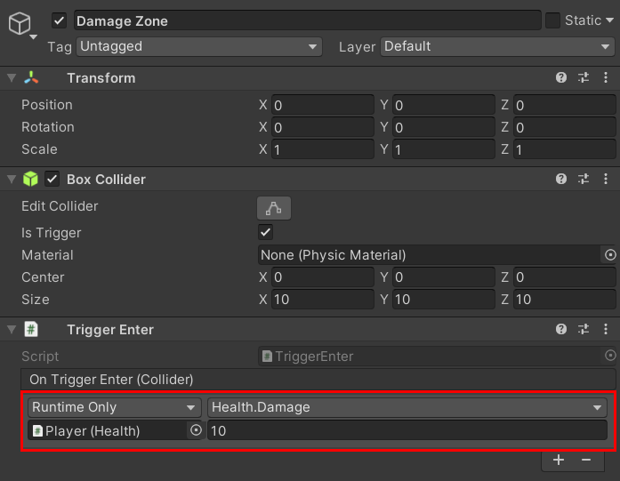

# Event Callbacks

It is very common for scripts in Unity projects to respond to collision/trigger events using Unity's event callback functions, such as `OnCollisionEnter` and `OnTriggerEnter`. In such events, you might need to communicate a state change to another object. This often leads to a lot of boilerplate code and miscellaneous scripts.

The **Physics Utils** package comes with several behaviors that serialize event callbacks into the editor so all you need to do is pick the function you want to be called on any object in your scene. It eliminates having to create entirely new scripts whenever you need a simple response to an event.

The great thing about Unity's event system is that it is not limited to only functions. You can also invoke property getters/setters, and you can even pass in arguments to functions. Let's say you want to damage your character's health when they enter an unsafe trigger zone, you could easily do that without writing any new code.

 

## 📟 Available Classes

- [CollisionEnter](/api/Zigurous.Physics.Events/CollisionEnter)
- [CollisionEnter2D](/api/Zigurous.Physics.Events/CollisionEnter2D)
- [CollisionExit](/api/Zigurous.Physics.Events/CollisionExit)
- [CollisionExit2D](/api/Zigurous.Physics.Events/CollisionExit2D)
- [CollisionStay](/api/Zigurous.Physics.Events/CollisionStay)
- [CollisionStay2D](/api/Zigurous.Physics.Events/CollisionStay2D)
- [TriggerEnter](/api/Zigurous.Physics.Events/TriggerEnter)
- [TriggerEnter2D](/api/Zigurous.Physics.Events/TriggerEnter2D)
- [TriggerExit](/api/Zigurous.Physics.Events/TriggerExit)
- [TriggerExit2D](/api/Zigurous.Physics.Events/TriggerExit2D)
- [TriggerStay](/api/Zigurous.Physics.Events/TriggerStay)
- [TriggerStay2D](/api/Zigurous.Physics.Events/TriggerStay2D)
